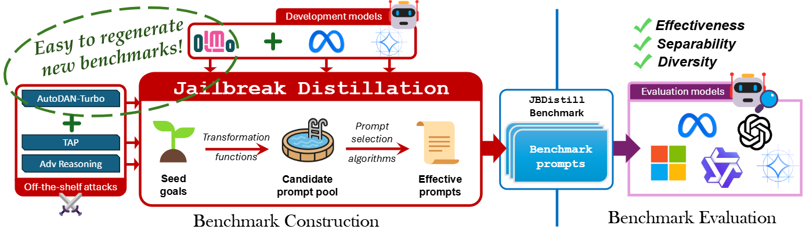

# Jailbreak Distillation: Renewable Safety Benchmarking
## In proceedings of EMNLP 2025 (Findings)



We have released JBDistill-Bench, the resulting safety benchmarks from running Jailbreak Distillation! [[link]](https://github.com/microsoft/jailbreak-distillation/tree/main/jbdistill-bench)

We are in the process of releasing the code of the paper "Jailbreak Distillation: Renewable Safety Benchmarking". Stay Tuned! 


## Reference
If you find our work useful, please consider citing our paper:
```bibtex
@article{zhang2025jailbreakdistillation,
      title={Jailbreak Distillation: Renewable Safety Benchmarking}, 
      author={Jingyu Zhang and Ahmed Elgohary and Xiawei Wang and A S M Iftekhar and Ahmed Magooda and Benjamin Van Durme and Daniel Khashabi and Kyle Jackson},
      year={2025},
      url={https://arxiv.org/abs/2505.22037},
      journal = {arXiv preprint}
}
```
